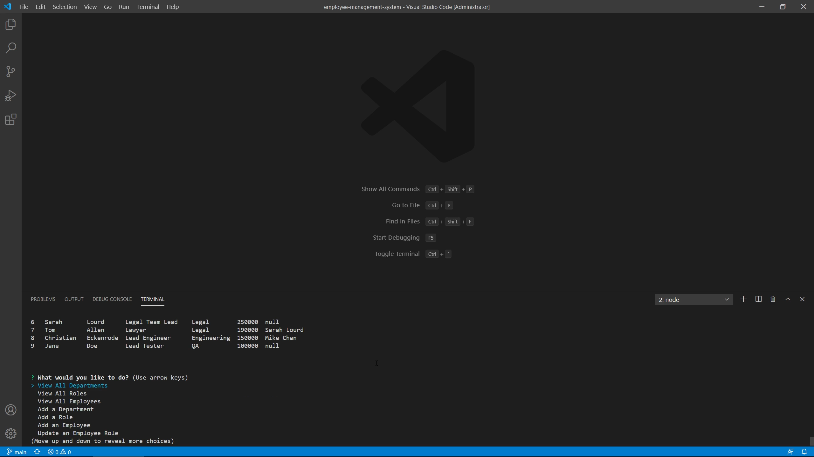

# Employee Management System

## Description

Uses command-line input to generate a team profile, including a manager, engineers, and interns, with various useful pieces of information for each.

## Made with
- Node.js
- Inquirer
- MySQL2
- ES6

## Installation

You will need a local install of MySQL. Your password for connecting to the MySQL server should go on line 10 of index.js where the "password" placeholder is.

- Run schema.sql in the MySQL command line utility to create the required database and tables
- Optionally run seeds.sql if you want pre-populated data to work with

To install additional dependencies from npm, run the following command:

```
npm i
```

## Usage

Run
```
node index
```
You can also click the image below to view a demonstration video

[](https://drive.google.com/file/d/1Ildnt6GeUYOhvqzmZhL-G4zzroEy0yzt/view?usp=sharing)
